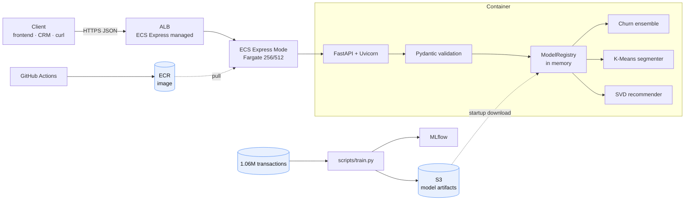

# Customer Intelligence API

A production-style FastAPI service for e-commerce customer intelligence. Three ML-powered
REST endpoints — churn prediction, customer segmentation, and product recommendations —
trained on **1,062,989 real retail transactions**, containerized, tested in CI, and
deployed to AWS.

Built as a backend service another frontend, mobile app, CRM, or internal system could
call with JSON and get ML results in real time.

**Status:** complete and verified end-to-end. Deployed live to AWS ECS Express Mode on
2026-08-07, verified against the public URL, then **deliberately torn down** to avoid an
idle load balancer bill. See [Deployment](#aws-deployment) and
[`docs/verification-report.md`](docs/verification-report.md).

---

## Endpoints

| Endpoint | Method | ML paradigm | Returns |
| --- | --- | --- | --- |
| `/health` | `GET` | Operations | Service status, loaded models, model version, `demo_mode` |
| `/predict/churn` | `POST` | Supervised classification | Churn probability + risk band |
| `/segment/customer` | `POST` | Unsupervised clustering | Business segment, cluster ID, distance to centroid |
| `/recommend` | `POST` | Collaborative filtering | Top-N ranked products with names |
| `/docs` | `GET` | — | Swagger UI (auto-generated) |

Live examples of every request and response:
[`docs/verification-report.md`](docs/verification-report.md).

---

## Architecture



Detailed diagrams — request path, startup/model-loading path, training pipeline, and IAM
trust relationships — are in [`docs/architecture.md`](docs/architecture.md).

**The key design choice:** model artifacts are **not** baked into the Docker image. They
are downloaded at startup from S3 via `CI_MODEL_ARTIFACT_URI`, so shipping a new model is
an S3 upload plus a restart — no 2 GB image rebuild, and code and models roll back
independently.

---

## Tech stack

| Layer | Choice |
| --- | --- |
| API | FastAPI, Uvicorn, Pydantic v2 |
| ML / data | pandas, NumPy, scikit-learn, XGBoost, SciPy |
| Model storage | joblib artifacts on S3 (or local dir / GCS) |
| Experiment tracking | MLflow |
| Testing | pytest, FastAPI `TestClient` |
| Container | Docker (`python:3.11-slim`, non-root user) |
| Cloud | AWS ECR, S3, ECS Express Mode, IAM OIDC |
| CI/CD | GitHub Actions |

Why each of these — and what was traded away — is in
[`docs/interview-notes.md`](docs/interview-notes.md).

---

## ML models

### Churn prediction — the part worth reading

The obvious way to label churn is `recency_days > 90 → churned`. That produces a ROC AUC
near 1.0 and a model that predicts nothing, because `recency_days` is also an input
feature — the model just reads the label off the feature. Classic target leakage.

This project uses **time-based snapshot labeling** instead
(`build_time_based_churn_dataset` in `app/ml/features.py`):

1. Pick 8 historical cutoff dates.
2. Build features from transactions **strictly before** each cutoff.
3. Label from whether the customer actually returned in the **following 90 days**.
4. Require ≥90 days of prior history per snapshot.

Features and labels come from disjoint time windows, so nothing leaks. This yields 30,823
training rows from 5,281 customers. The honest result is **ROC AUC 0.7916** — a lower
number than the leaky version, and the correct one.

The model itself is a weighted ensemble: XGBoost (`0.65`) + scikit-learn MLP (`0.35`),
falling back to `HistGradientBoostingClassifier` if XGBoost is unavailable.

### Customer segmentation

`StandardScaler` → K-Means (`k=4`) over the seven customer features, wrapped in a
`Pipeline` so identical scaling is applied at train and inference time. Scaling is not
optional here: `monetary` spans thousands while `frequency` spans single digits, so
unscaled Euclidean distance would be driven almost entirely by `monetary`.

Cluster IDs are deterministically mapped to business names from each cluster's feature
means — `high-value`, `dormant`, `new`, `at-risk` — so cluster `0` means the same thing
across retrains. The response also returns `distance_to_centroid` as an honesty signal:
a large distance means the customer sits between clusters.

### Product recommendations

Collaborative filtering over a sparse 5,878 × 4,631 customer–product interaction matrix.
Quantities are `log1p`-transformed so bulk orders do not dominate, then factorized with
`TruncatedSVD` (50 components).

Cold start degrades gracefully in three tiers: known customer → learned latent vector;
unknown customer with recognizable `recent_product_ids` → mean of those item vectors;
nothing recognizable → global popularity. `/recommend` always returns results and never
errors on an unknown ID.

---

## Model metrics

Trained from `data/online_retail_cleaned.csv`. **These numbers were re-verified by a full
retrain on 2026-08-07 and reproduce to four decimal places** — see
[`docs/verification-report.md`](docs/verification-report.md).

| Metric | Value |
| --- | ---: |
| Churn ROC AUC | `0.7916` |
| Churn average precision | `0.8232` |
| Churn accuracy | `0.7372` |
| Segmentation silhouette | `0.4061` |
| Recommender products | `4,631` |
| Recommender customers | `5,878` |
| Churn training rows | `30,823` |
| Churn training customers | `5,281` |
| Raw transactions | `1,062,989` |
| Clean transactions | `805,549` |

Limitations and intended use: [`docs/model-card.md`](docs/model-card.md).

---

## Quick start

Requires Python **3.11** — several ML wheels (XGBoost, SciPy) lag on newer releases.

```powershell
py -3.11 -m venv .venv
.\.venv\Scripts\Activate.ps1
python -m pip install --upgrade pip setuptools wheel
python -m pip install -r requirements.txt -r requirements-dev.txt
```

**Run with demo models** (no dataset needed — good for a 30-second look):

```powershell
python -m scripts.create_demo_artifacts
python -m uvicorn app.main:app --reload
```

**Run with real trained models:**

```powershell
$env:CI_MODEL_DIR="models"
$env:CI_ALLOW_DEMO_MODELS="false"
python -m uvicorn app.main:app --reload
```

Open <http://127.0.0.1:8000/docs>. `GET /health` should show `"demo_mode": false`.

---

## Train the models

```powershell
python -m scripts.train --transactions data\online_retail_cleaned.csv --output-dir models
```

Progress is printed at each stage:

```text
[1/8] Loading transactions from data\online_retail_cleaned.csv...
  - raw rows: 1,062,989
[2/8] Cleaning transactions...
  - cleaned rows: 805,549
[3/8] Building latest customer features...
  - customers: 5,878
[4/8] Building time-based churn training snapshots...
  - churn rows: 30,823
  - churn customers: 5,281
[5/8] Starting MLflow experiment 'customer-intelligence'...
[6/8] Training churn ensemble...
  Churn metrics:
  - roc_auc: 0.7916
  - average_precision: 0.8232
  - accuracy: 0.7372
[7/8] Training K-Means customer segmentation...
  Segmentation metrics:
  - silhouette: 0.4061
[8/8] Training collaborative filtering recommender and saving artifacts...
  Recommender stats:
  - items: 4631
  - users: 5878
Done. Artifacts written to ...\models
```

Produces `models/{churn_model,segment_model,recommender}.joblib` and `metadata.json`.

### Inspect a trained bundle

```powershell
python -m scripts.inspect_metadata --model-dir models
```

```text
Model bundle: ...\models

  version      20260613-194657
  created_at   2026-06-13T19:46:57.648668+00:00
  demo_mode    False
  features     7: recency_days, frequency, monetary, tenure_days, ...

  Churn training:
    strategy                 time_based_snapshots
    prediction_window_days   90
    snapshots                8
    rows                     30,823

  Metrics:
  churn:
    roc_auc              0.7916
  ...

  Artifacts:
    [ok]      churn        churn_model.joblib       434.5 KB
    [ok]      segment      segment_model.joblib      25.1 KB
    [ok]      recommender  recommender.joblib         6.7 MB

Bundle is complete.
```

Exits non-zero if the bundle is incomplete, so it works as a pre-deploy gate. Add
`--json` for the raw `metadata.json`.

### MLflow

```powershell
python -m mlflow ui --backend-store-uri mlruns --port 5000
```

Open <http://127.0.0.1:5000>. Each run logs parameters, metrics, and the model artifacts
that produced them.

---

## Example requests

Ready-to-use payloads live in `examples/`.

**Churn:**

```powershell
curl -X POST http://127.0.0.1:8000/predict/churn `
  -H "Content-Type: application/json" `
  -d "@examples/churn_request.json"
```

```json
{ "customer_id": "17850", "churn_probability": 0.1117,
  "risk_band": "low", "model_version": "20260613-194657" }
```

**Segmentation:**

```json
{ "customer_id": "17850", "segment": "new", "cluster_id": 0,
  "distance_to_centroid": 1.3553, "model_version": "20260613-194657" }
```

**Recommendations:**

```powershell
curl -X POST http://127.0.0.1:8000/recommend `
  -H "Content-Type: application/json" `
  -d "@examples/recommend_request.json"
```

```json
{ "customer_id": "17850", "recommendations": [
    { "product_id": "72752A", "score": 68.4423, "name": "F.FAIRY,CANDLE IN GLASS,LILY/VALLEY" },
    { "product_id": "35603B", "score": 55.0456, "name": "S/16 BLACK SHINY/MAT BAUBLES" },
    { "product_id": "21343",  "score": 44.9041, "name": "GOLD JEWELERY BOX" }
  ], "model_version": "20260613-194657" }
```

Invalid input is rejected at the edge with the offending field named:

```json
{ "detail": [ { "type": "greater_than_equal",
                "loc": ["body", "customer", "recency_days"],
                "msg": "Input should be greater than or equal to 0", "input": -5 } ] }
```

---

## Tests

```powershell
python -m pytest
```

```text
12 passed
```

Coverage: API contracts for all four endpoints, invalid-request validation, column-alias
cleaning, the time-based churn labeling logic, registry metadata loading, the
missing-artifact failure path, and recommender cold-start fallback.

### Smoke test a running instance

`scripts/smoke_test.py` exercises every endpoint against any URL — local, Docker, or a
deployed AWS service — and exits non-zero on failure, so it doubles as a deployment gate.

```powershell
python -m scripts.smoke_test --base-url http://127.0.0.1:8080 --wait 60 --require-real-models
```

```text
Smoke-testing http://127.0.0.1:8080
  [ok]   health               GET /health -> 200  model_version=20260613-194657
  [ok]   churn                POST /predict/churn -> 200  churn_probability=0.1117
  [ok]   segment              POST /segment/customer -> 200  segment=new
  [ok]   recommend            POST /recommend -> 200  5 recommendations
  [ok]   docs                 GET /docs -> 200
  [ok]   rejects bad input    POST /predict/churn -> 422
  [ok]   all models loaded    version=20260613-194657
  [ok]   demo_mode: false     serving real trained models

All smoke checks passed.
```

`--require-real-models` makes `demo_mode: true` a failure rather than a warning.

---

## Docker

```powershell
docker build -t customer-intelligence-api:local .
```

Run with real model artifacts mounted:

```powershell
docker run --rm -p 8080:8080 `
  -e CI_MODEL_DIR=/app/models -e CI_ALLOW_DEMO_MODELS=false `
  -v "C:\Users\azadh\OneDrive\Documents\ecommerceAPI\models:/app/models:ro" `
  customer-intelligence-api:local
```

Or pull models straight from S3, exactly as production does:

```powershell
docker run --rm -p 8080:8080 `
  -e CI_ALLOW_DEMO_MODELS=false `
  -e CI_MODEL_ARTIFACT_URI="s3://customer-intelligence-models-harsh1314h/customer-intelligence/models/" `
  -e AWS_REGION=ap-south-1 `
  -e AWS_ACCESS_KEY_ID -e AWS_SECRET_ACCESS_KEY `
  customer-intelligence-api:local
```

Then smoke-test it:

```powershell
python -m scripts.smoke_test --base-url http://127.0.0.1:8080 --wait 60 --require-real-models
```

The image runs as a non-root user (`apiuser`) on Python 3.11, and produces predictions
byte-identical to the local venv.

> **Windows:** run the `docker run` command from **PowerShell**, not Git Bash. Git Bash
> rewrites the Windows path in `-v`, the mount silently resolves to an empty directory,
> and the container exits with `RuntimeError: Missing model artifacts`.

---

## AWS deployment

Deployed to **ECS Express Mode** in `ap-south-1` (account `188947281989`). App Runner was
the original target but stopped accepting new customers after 2026-04-30; ECS Express
Mode is the closest replacement — it provisions the ALB, target groups, security groups,
and autoscaling from a single API call.

### Verified live on 2026-08-07

```text
https://cu-2e0fbe4eb0454f1facc22a5cf4b20836.ecs.ap-south-1.on.aws

GET  /health         -> 200  demo_mode: false, all 3 models loaded from S3
GET  /docs           -> 200  Swagger UI
POST /predict/churn  -> 200  {"churn_probability":0.1117,"risk_band":"low"}
```

That same input returns `0.1117` in the local venv, in the local container, and when
loading artifacts from S3 — identical predictions across four environments.

### Current state — intentionally torn down

| Resource | State |
| --- | --- |
| ECR repository, S3 artifacts, IAM roles, OIDC provider, ECS cluster | **kept** (≈\$0/month) |
| ECS Express service, Application Load Balancer | **deleted** (would be ≈\$26/month) |

Confirmed on 2026-08-07: `aws ecs list-services` and `aws elbv2 describe-load-balancers`
both return empty. **The URL above is not live right now** — leaving an idle ALB running
for a portfolio demo costs about \$17/month, so the evidence was captured instead.

Redeploy commands (about 6 minutes to serve traffic; Express Mode's canary step
legitimately shows 0 running tasks first) and the teardown step are in
[`docs/architecture.md`](docs/architecture.md#redeploying-for-a-live-demo) and the
"AWS Deployment History" section of `context.md`.

### Cost control — deployment is manual on purpose

`.github/workflows/deploy.yml` runs **tests on every push**, but the `deploy-aws` job
fires **only on manual `workflow_dispatch`**:

```yaml
deploy-aws:
  needs: test
  if: github.event_name == 'workflow_dispatch'
```

So a routine code change never creates AWS resources as a side effect. To deploy, open the
repository's **Actions** tab and click **Run workflow**. This is deliberate: an idle ECS
service plus its load balancer is roughly \$26/month, which is not a reasonable price for
a push that fixed a typo.

**After demoing, tear it down:**

```powershell
aws ecs delete-express-gateway-service `
  --service-arn "arn:aws:ecs:ap-south-1:188947281989:service/default/customer-intelligence-api" `
  --region ap-south-1
```

Deletion is asynchronous — the ALB takes 9–13 minutes to disappear. Confirm with
`aws elbv2 describe-load-balancers --region ap-south-1` returning an empty list before
considering it done.

### CI/CD

GitHub Actions authenticates to AWS with **OIDC** (`sts:AssumeRoleWithWebIdentity`) — no
long-lived AWS access keys are stored in GitHub. The `deploy-aws` job depends on `test`,
so a failing suite blocks deployment.

**What CI has actually proven** (run `30171460578`, 2026-07-25):

```text
[ok]   test job                  12 passed
[ok]   checkout
[ok]   Configure AWS credentials  "Assuming role with OIDC"  (no static keys)
[ok]   Create ECR repository if missing
[ok]   Login to Amazon ECR
[ok]   Build and push image       digest: sha256:54dde6b6987e6de7...
[--]   Deploy ECS Express service SKIPPED - ECS role secrets were empty at the time
[ok]   Print deployment summary
```

So the pipeline is verified through OIDC authentication, image build, and ECR push — that
`b78df7d…` image tag is still in the registry today. **The one step never exercised via CI
is the final `amazon-ecs-deploy-express-service` action.** It was skipped because the two
ECS role secrets had not been added yet; they were added on 2026-08-06, and the re-run
triggered to pick them up was caught by a platform-wide GitHub Actions outage and never
started. The live deployment was therefore performed manually via AWS CLI instead.

That last step will be exercised the first time the workflow is dispatched manually.

---

## Configuration

| Variable | Purpose | Production value |
| --- | --- | --- |
| `CI_MODEL_DIR` | Local directory models are loaded from | `/app/models` |
| `CI_MODEL_ARTIFACT_URI` | Optional `s3://`, `gs://`, or local path to sync artifacts from at startup | the S3 models prefix |
| `CI_ALLOW_DEMO_MODELS` | Generate toy artifacts when real ones are missing | `false` |
| `CI_CORS_ORIGINS` | Allowed CORS origins | your frontend origin |

With `CI_ALLOW_DEMO_MODELS=false`, a missing artifact **crashes the container at
startup** instead of silently serving toy predictions. Failing loudly at deploy time
beats a healthy-looking service returning meaningless numbers.

---

## Project structure

```text
app/
  main.py                 FastAPI app, endpoints, lifespan model loading
  schemas.py              Pydantic request/response contracts
  config.py               Environment-based settings (CI_* prefix)
  ml/
    artifacts.py          Artifact sync from S3 / GCS / local dir
    churn.py              Weighted churn ensemble
    demo.py               Demo artifact generation
    features.py           Cleaning, feature engineering, time-based churn labels
    recommender.py        SVD collaborative filtering + cold-start fallback
    registry.py           Loads artifacts once at startup, holds them in memory
    segmentation.py       K-Means prediction wrapper
scripts/
  train.py                Training pipeline (8 logged stages)
  inspect_metadata.py     CLI summary of a trained model bundle
  smoke_test.py           Endpoint smoke test for any running instance
  create_demo_artifacts.py
tests/                    12 tests: API, features, registry, recommender
examples/                 Ready-to-use request/response JSON
docs/
  architecture.md         System, request, startup, training, and IAM diagrams
  interview-notes.md      Design decisions and trade-offs
  model-card.md           Models, metrics, limitations, intended use
  verification-report.md  Full end-to-end verification evidence
  aws-deployment.md       AWS setup guide
.github/workflows/
  deploy.yml              Test -> build -> push to ECR -> deploy ECS Express
Dockerfile                python:3.11-slim, non-root user
pytest.ini                pythonpath = . (so CI can import `app`)
```

---

## Known limitations

Stated plainly rather than buried:

- **No authentication or rate limiting.** The endpoints are open.
- **No structured logging, tracing, or metrics.** No request IDs, no latency histograms.
- **No model monitoring.** Nothing detects feature drift or score-distribution collapse.
- **The churn evaluation split is random, not strictly time-based.** Snapshots overlap and
  the same customer appears in several rows, so the reported AUC is probably slightly
  optimistic.
- **Ensemble weights (0.65/0.35) are untuned** — a judgement call, not a swept result.
- **No recommendation evaluation metric.** Offline precision@k on implicit purchase data
  is hard to do honestly; the real answer is an A/B test.
- **The image is 2.1 GB.** A multi-stage build dropping MLflow from the runtime image
  would cut it substantially.
- **`data/`, `models/`, `mlruns/`, and `.venv/` are gitignored** — the dataset and
  artifacts are not in this repository.
