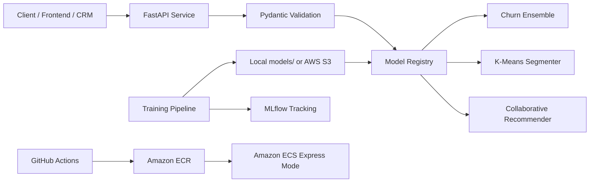

# Customer Intelligence API

A production-style FastAPI service for e-commerce customer intelligence. It exposes three ML-powered REST endpoints for churn prediction, customer segmentation, and product recommendations.

This project is designed like a backend service that another frontend, mobile app, CRM, or internal system could call with JSON and receive ML results in real time.

## What It Does

| Endpoint | Method | ML Paradigm | Purpose |
| --- | --- | --- | --- |
| `/health` | `GET` | Operations | Confirms service and model loading status |
| `/predict/churn` | `POST` | Supervised learning | Predicts customer churn probability |
| `/segment/customer` | `POST` | Unsupervised learning | Assigns a customer segment using K-Means |
| `/recommend` | `POST` | Recommender systems | Returns top-N product recommendations |

## Architecture



## Tech Stack

- **API:** FastAPI, Uvicorn, Pydantic
- **ML/data:** Pandas, NumPy, scikit-learn, XGBoost, SciPy
- **Model storage:** joblib artifacts
- **Experiment tracking:** MLflow
- **Testing:** pytest, FastAPI TestClient
- **Containerization:** Docker
- **Cloud target:** AWS S3, ECR, ECS Express Mode
- **CI/CD:** GitHub Actions

## ML Models

### Churn Prediction

The churn endpoint uses a supervised classification ensemble:

- XGBoost classifier when available
- scikit-learn MLP neural network
- weighted average of both model probabilities

Training uses time-based churn labels. The pipeline builds customer features from behavior before a cutoff date, then checks whether the customer returned in the next prediction window. This avoids the shortcut of simply labeling churn from current `recency_days`.

### Customer Segmentation

The segmentation endpoint uses K-Means clustering on customer-level behavior features. Cluster IDs are mapped into readable business labels:

- `high-value`
- `at-risk`
- `new`
- `dormant`

### Product Recommendations

The recommendation endpoint uses collaborative filtering over customer-product purchase history. It builds an interaction matrix and uses Truncated SVD to learn product/customer similarity patterns.

## Current Model Metrics

The latest trained model artifacts were generated from `data/online_retail_cleaned.csv`.

| Metric | Value |
| --- | ---: |
| Churn ROC AUC | `0.7916` |
| Churn average precision | `0.8232` |
| Churn accuracy | `0.7372` |
| Segmentation silhouette | `0.4061` |
| Recommender products | `4,631` |
| Recommender customers | `5,878` |
| Churn training rows | `30,823` |
| Churn training customers | `5,281` |

## Project Structure

```text
app/
  main.py                 FastAPI app and endpoint routing
  schemas.py              Pydantic request/response contracts
  config.py               Environment-based settings
  ml/
    artifacts.py          Local, S3, and GCS artifact loading
    churn.py              Churn ensemble wrapper
    demo.py               Demo artifact generation
    features.py           Data cleaning and feature engineering
    recommender.py        Collaborative filtering recommender
    registry.py           Model loading and registry
    segmentation.py       K-Means prediction wrapper
scripts/
  train.py                Main ML training pipeline
  create_demo_artifacts.py
tests/
  test_api.py
  test_features.py
  test_registry.py
  test_recommender.py
examples/
  churn_request.json
  segment_request.json
  recommend_request.json
  health_response.json
docs/
  aws-deployment.md
Dockerfile
requirements.txt
requirements-dev.txt
```

## Local Setup

Use Python `3.11`. Some ML packages may not have stable wheels for newer Python versions.

```powershell
cd "C:\Users\azadh\OneDrive\Documents\ecommerceAPI"
py -3.11 -m venv .venv
.\.venv\Scripts\Activate.ps1
python -m pip install --upgrade pip setuptools wheel
python -m pip install -r requirements.txt -r requirements-dev.txt
```

## Run The API Locally

Use demo models:

```powershell
python -m scripts.create_demo_artifacts
python -m uvicorn app.main:app --reload
```

Use real trained models:

```powershell
$env:CI_MODEL_DIR="models"
$env:CI_ALLOW_DEMO_MODELS="false"
python -m uvicorn app.main:app --reload
```

Open Swagger UI:

```text
http://127.0.0.1:8000/docs
```

Check:

```text
GET /health
```

For real models, `/health` should show:

```json
"demo_mode": false
```

## Train Real Models

The current training dataset is:

```text
data/online_retail_cleaned.csv
```

Run:

```powershell
python -m scripts.train --transactions data\online_retail_cleaned.csv --output-dir models
```

The trainer prints progress:

```text
[1/8] Loading transactions...
[2/8] Cleaning transactions...
[3/8] Building latest customer features...
[4/8] Building time-based churn training snapshots...
[5/8] Starting MLflow experiment...
[6/8] Training churn ensemble...
[7/8] Training K-Means customer segmentation...
[8/8] Training collaborative filtering recommender and saving artifacts...
```

Generated artifacts:

```text
models/churn_model.joblib
models/segment_model.joblib
models/recommender.joblib
models/metadata.json
```

## MLflow Tracking

Start MLflow UI:

```powershell
python -m mlflow ui --backend-store-uri mlruns --port 5000
```

Open:

```text
http://127.0.0.1:5000
```

MLflow tracks parameters, metrics, and model artifacts for each training run.

## Example Requests

Ready-to-copy examples:

- `examples/churn_request.json`
- `examples/segment_request.json`
- `examples/recommend_request.json`
- `examples/health_response.json`

Churn:

```powershell
curl -X POST http://127.0.0.1:8000/predict/churn `
  -H "Content-Type: application/json" `
  -d "{\"customer\":{\"customer_id\":\"17850\",\"recency_days\":22,\"frequency\":18,\"monetary\":3420.5,\"tenure_days\":340,\"avg_order_value\":190.03,\"total_items\":620,\"unique_products\":47}}"
```

Recommendation:

```powershell
curl -X POST http://127.0.0.1:8000/recommend `
  -H "Content-Type: application/json" `
  -d "{\"customer_id\":\"17850\",\"recent_product_ids\":[\"85123A\",\"71053\"],\"top_n\":5,\"include_seen\":false}"
```

## Tests

Run:

```powershell
python -m pytest
```

Current local result:

```text
12 passed
```

The tests cover:

- API contracts
- invalid request validation
- data cleaning aliases
- time-based churn labels
- model registry metadata
- recommender fallback behavior

## Docker

Build:

```powershell
docker build -t customer-intelligence-api:local .
```

Run with real local model artifacts:

```powershell
docker run --rm -p 8080:8080 -e CI_MODEL_DIR=/app/models -e CI_ALLOW_DEMO_MODELS=false -v "C:\Users\azadh\OneDrive\Documents\ecommerceAPI\models:/app/models:ro" customer-intelligence-api:local
```

Open:

```text
http://127.0.0.1:8080/docs
```

## AWS Deployment Status

AWS deployment uses ECS Express Mode because AWS App Runner is no longer accepting new customers after April 30, 2026.

Completed:

- S3 bucket created
- Model artifacts uploaded to:

```text
s3://customer-intelligence-models-harsh1314h/customer-intelligence/models/
```

Prepared:

- GitHub Actions AWS workflow in `.github/workflows/deploy.yml`
- AWS deployment guide in `docs/aws-deployment.md`

Remaining:

- Create ECS IAM roles
- Add GitHub secrets
- Push Docker image to ECR
- Deploy AWS ECS Express service
- Verify public `/health` and `/docs`

## Environment Variables

| Variable | Purpose |
| --- | --- |
| `CI_MODEL_DIR` | Local directory where models are loaded from |
| `CI_MODEL_ARTIFACT_URI` | Optional cloud artifact path, such as `s3://bucket/prefix/` |
| `CI_ALLOW_DEMO_MODELS` | Allows fallback demo artifacts when real artifacts are missing |
| `CI_CORS_ORIGINS` | Allowed CORS origins |

Production should use:

```text
CI_ALLOW_DEMO_MODELS=false
CI_MODEL_ARTIFACT_URI=s3://customer-intelligence-models-harsh1314h/customer-intelligence/models/
```

## Notes

- `data/`, `models/`, `.venv/`, and `mlruns/` are intentionally ignored by Git.
- Model files are stored locally for development and in S3 for deployment.
- The API loads trained models once at startup through `ModelRegistry`.
- Training is offline; prediction happens online through FastAPI endpoints.
