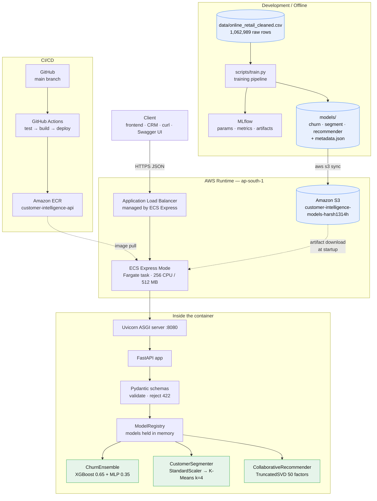
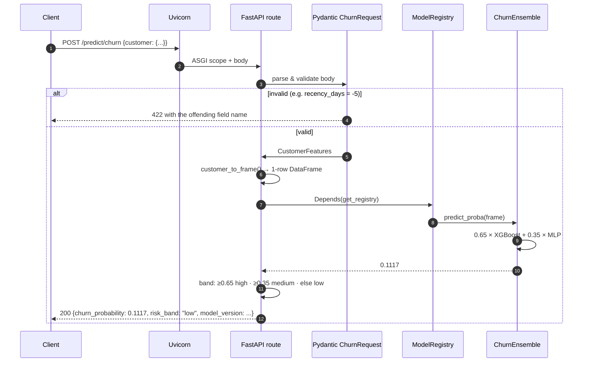
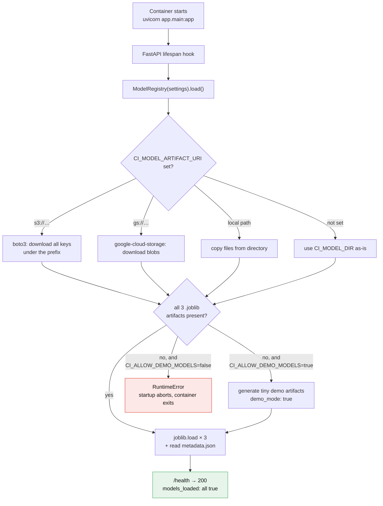
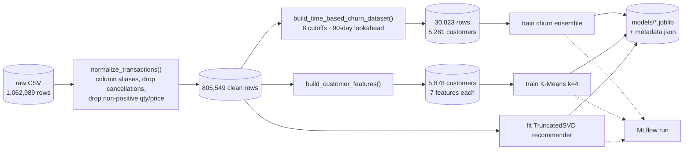
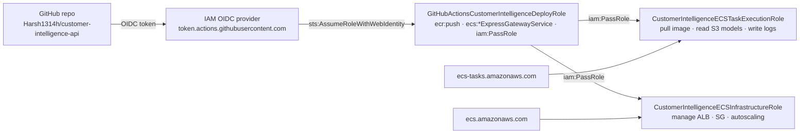

# Architecture

How the pieces fit together, and what happens on a single request.

---

## System overview



---

## Request path — a single `POST /predict/churn`



Two things worth noting:

- **Models are loaded once**, in the FastAPI `lifespan` startup hook, not per request.
  `ModelRegistry` holds them in memory for the process's lifetime, so a prediction is
  pure CPU with no disk or network I/O.
- **Validation happens before any model code runs.** A malformed request never reaches
  scikit-learn.

---

## Startup path — where models come from



**Why the failure branch matters.** In production, `CI_ALLOW_DEMO_MODELS=false` means a
missing artifact **crashes the container at startup** rather than silently serving toy
predictions. Failing loudly at deploy time is much better than a healthy-looking service
returning meaningless numbers. That branch is covered by
`tests/test_registry.py::test_registry_errors_when_artifacts_missing_and_demo_disabled`.

---

## Training pipeline



The churn branch is the one that matters — see
[interview-notes.md](interview-notes.md#why-time-based-churn-labels-the-most-important-ml-decision-here)
for why features and labels are drawn from disjoint time windows.

---

## AWS resources

Region `ap-south-1`, account `188947281989`.

| Resource | Name | State | Cost when idle |
| --- | --- | --- | ---: |
| ECR repository | `customer-intelligence-api` | kept | ~\$0 (a few GB storage) |
| S3 bucket | `customer-intelligence-models-harsh1314h` | kept | ~\$0 (7.5 MB) |
| IAM role | `CustomerIntelligenceECSTaskExecutionRole` | kept | free |
| IAM role | `CustomerIntelligenceECSInfrastructureRole` | kept | free |
| IAM role | `GitHubActionsCustomerIntelligenceDeployRole` | kept | free |
| IAM OIDC provider | `token.actions.githubusercontent.com` | kept | free |
| ECS cluster | `default` (empty) | kept | free |
| **ECS Express service** | `customer-intelligence-api` | **torn down** | ~\$9/mo if running |
| **Application Load Balancer** | ECS-managed | **torn down** | ~\$17/mo if running |

The two billable resources are deliberately **not** left running. The service was
deployed, verified end-to-end, and removed — see
[`verification-report.md`](verification-report.md) and the "AWS Deployment History"
section of `context.md`.

### IAM trust relationships



No long-lived AWS access keys exist in GitHub. CI authenticates with a short-lived OIDC
token exchanged for temporary credentials.

---

## Redeploying (for a live demo)

Full commands and the teardown step are in the "AWS Deployment History" section of
`context.md`. The short version:

```powershell
$env:Path += ";$env:LOCALAPPDATA\Programs\Amazon\AWSCLIV2"
$registry = "188947281989.dkr.ecr.ap-south-1.amazonaws.com"
$pw = aws ecr get-login-password --region ap-south-1
docker login --username AWS --password $pw $registry
docker build -t "$registry/customer-intelligence-api:latest" .
docker push "$registry/customer-intelligence-api:latest"
aws ecs create-express-gateway-service --service-name customer-intelligence-api --cluster default ...
```

Expect roughly **6 minutes** before traffic is served — the canary step holds at 0 running
tasks first. **Tear it down afterwards:**

```powershell
aws ecs delete-express-gateway-service `
  --service-arn "arn:aws:ecs:ap-south-1:188947281989:service/default/customer-intelligence-api" `
  --region ap-south-1
```

Deletion is asynchronous; the ALB takes 9–13 minutes to disappear. Confirm with
`aws elbv2 describe-load-balancers --region ap-south-1` returning an empty list before
considering teardown complete.

> **Note on Windows PowerShell:** `aws ecr get-login-password | docker login --password-stdin`
> fails with a `400 Bad Request` because the pipe mangles the token's encoding for native
> binaries. Pass the password as an argument instead, as shown above.
